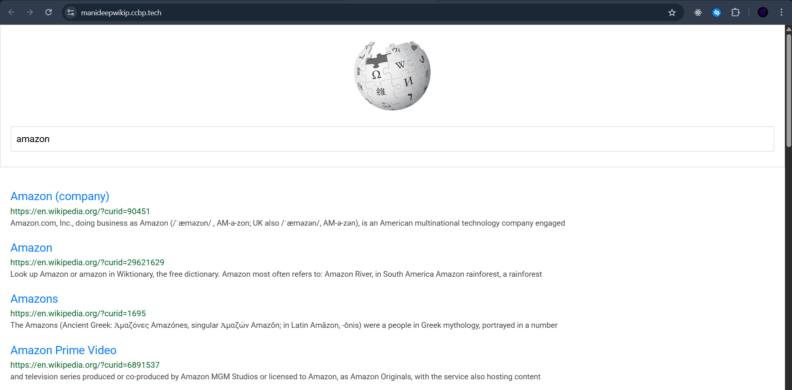

# Wikipedia-Search-Application
# 🔍 Wikipedia Search App

A sleek and simple app that fetches and displays Wikipedia search results in real-time using the Wikipedia API. Built with **HTML**, **CSS**, and **JavaScript**.

## 📸 Demo




## 🚀 Features

- 🔎 Instant Wikipedia search
- ⚡ Real-time API fetching
- 🖼️ Spinner loader while fetching
- 📄 Results with title, link, and description

## 🛠️ Tech Stack

- HTML5
- CSS3 (with Bootstrap 4)
- JavaScript (Vanilla JS)
- Wikipedia REST API

## 📸 Demo

 

## 📁 How to Use

1. Clone the repo:
   ```bash
   git clone https://github.com/sai-manideep-exe/Wikipedia-Search-Application.git
